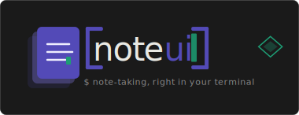

[](https://github.com/atbuy/noteui/actions/workflows/ci.yml)
[](https://codecov.io/gh/atbuy/noteui)
[](https://atbuy.github.io/noteui/)



# noteui

`noteui` is a terminal note-taking application for browsing, searching, previewing, and organizing plain-text notes stored as regular files.

It is built for people who want a keyboard-driven notes workflow without giving up normal files, directories, and external editors.


## Table of contents

- [Try it in 30 seconds](#try-it-in-30-seconds)
- [Documentation](#documentation)
- [Highlights](#highlights)
- [Install](#install)
- [Quick start](#quick-start)
- [Key features](#key-features)
  - [Notes and organization](#notes-and-organization)
  - [Themes](#themes)
  - [Sync](#sync)
  - [Todos](#todos)
  - [Encryption](#encryption)
- [CLI options](#cli-options)
- [Sync setup](#sync-setup)
- [Build from source](#build-from-source)

---

## Try it in 30 seconds

Already installed noteui? Run:

```sh
noteui --demo
```

This launches the UI against a bundled set of sample notes copied into a throwaway temporary directory. Your real notes root is not touched, sync is disabled for the session, and the temp directory is cleaned up automatically when you quit. See [Demo mode](https://atbuy.github.io/noteui/guide/usage/#demo-mode) for details.

## Documentation

Full documentation is published at:

<https://atbuy.github.io/noteui/>

Recommended entry points:

- [Getting started](https://atbuy.github.io/noteui/tutorial/getting-started/)
- [Installation](https://atbuy.github.io/noteui/tutorial/installation/)
- [Usage guide](https://atbuy.github.io/noteui/guide/usage/)
- [Keybindings](https://atbuy.github.io/noteui/guide/keybindings/)
- [Configuration reference](https://atbuy.github.io/noteui/reference/configuration/)
- [Environment variables](https://atbuy.github.io/noteui/reference/environment/)
- [FAQ](https://atbuy.github.io/noteui/faq/)

## Highlights

- browse notes and categories in a tree view
- preview notes directly in the terminal with search highlighting
- search by title, path, content preview, and tags
- create, rename, move, and delete notes or categories
- keep temporary notes separate from your main notes
- create and manage todo notes, with a global open-tasks view
- promote, archive, and batch-process temporary notes
- pin important notes and categories
- automatic version history for every note, with an in-app rollback modal (`H`)
- live theme picker with instant full-UI preview (`ctrl+y`), 20+ built-in themes
- optional SSH-based sync for `sync: synced` notes with tree sync markers
- per-workspace `sync_remote_root` keeps multiple workspaces isolated on the remote
- encrypted note bodies, with atomic writes and history-based recovery
- customize theme, preview behavior, icons, and keybindings
- keep your notes as regular files on disk
- switch between named workspaces with isolated local UI state
- command palette (`ctrl+p`) for quick access to every action

## Install

Quick install examples:

Linux / macOS:

```sh
curl -fsSL https://raw.githubusercontent.com/atbuy/noteui/main/install.sh | sh
```

Windows PowerShell:

```powershell
irm https://raw.githubusercontent.com/atbuy/noteui/main/install.ps1 | iex
```

The easiest manual install path is still the pre-built release archives:

<https://github.com/atbuy/noteui/releases>

Linux and macOS releases are published as `.tar.gz` archives. Windows releases are published as `.zip` archives. Each release archive includes both `noteui` and `noteui-sync`.

## Quick start

1. Download the right release archive for your platform from the releases page.
2. Extract it.
3. Run `noteui`.
4. Start writing notes in your notes directory, which defaults to `$HOME/notes`.

By default, `noteui`:

- uses `$HOME/notes` as the notes root unless a workspace profile or `NOTES_ROOT` override is active
- stores temporary notes under `.tmp` inside the notes root
- opens notes with `NOTEUI_EDITOR`, then `EDITOR`, then `nvim`
- stores local UI state under `$HOME/.local/state/noteui/state.json`

## Key features

### Notes and organization

Notes are plain Markdown files. noteui adds no proprietary format - you can open, edit, and move them with any tool.

- **Tree view**: categories are directories; collapse and expand with `h`/`l`
- **Editor**: opens with your `$EDITOR`; noteui resumes after you close it
- **Search**: `/` filters by title, path, content, and tags; `#tag` to narrow by tag
- **Pins**: `p` pins any note or category; `P` jumps to the pinned items view
- **Version history**: `H` opens a rollback modal with every saved revision
- **Trash browser**: `X` lists trashed notes so you can restore them; `Z` undoes the last trash
- **Daily notes**: `D` opens or creates today's note (configurable path and template)

### Themes

noteui ships with 20+ built-in color themes. You can switch themes three ways:

- **In-app theme picker** (`ctrl+y`): hover to preview the full UI live, `enter` to apply, `esc` to cancel
- **CLI**: `noteui +set-theme <name>` switches the active theme without opening the UI
- **Config**: set `theme.name` in `config.toml`

To list all available themes with color swatches:

```sh
noteui +themes
```

### Sync

noteui has optional SSH-based sync. Mark a note with `sync: synced` in its frontmatter and noteui will replicate it to a configured remote host using a small helper binary (`noteui-sync`). See [Sync setup](#sync-setup) below.

### Todos

Notes that contain Markdown checkboxes (`- [ ] item`) are recognized as todo lists. The global todos view (`ctrl+t`) aggregates all open tasks across all notes into a single scrollable list. From there you can toggle, edit, and jump to the source note.

### Encryption

`E` toggles encryption on the selected note. Encrypted notes are stored as opaque blobs and decrypted in-memory for preview and editing. Passphrases are per-note and prompted when needed.

## CLI options

```
noteui [options]

Options:
  -h, --help            Show help
  -v, --version         Print version and exit
  --demo                Launch in demo mode with sample notes
  -w, --capture TEXT    Append TEXT to inbox.md without opening the UI

Theme management:
  +themes               List all available themes with color previews
  +set-theme <name>     Switch the active theme without opening the UI

Environment variables:
  NOTES_ROOT            Override the default notes root directory
  NOTEUI_CONFIG         Path to a custom config.toml
```

## Sync setup

Sync is optional and SSH-based.

1. Build or install both binaries:
   - `noteui`
   - `noteui-sync`
2. Put `noteui-sync` on the remote machine in a path you can call over SSH.
3. Pick a remote storage directory on that machine, for example `/srv/noteui`.
4. Add a sync profile to your `config.toml`:

```toml
[sync]
default_profile = "homebox"

[sync.profiles.homebox]
ssh_host = "notes-prod"
remote_root = "/srv/noteui"
remote_bin = "/usr/local/bin/noteui-sync"
```

5. Mark any note you want synced with frontmatter:

```yaml
---
sync: synced
---
```

Notes without that field, or with `sync: local`, stay local-only. Sync status in the tree works like this:

- hollow red `○`: local-only note
- green `●`: synced note with a confirmed healthy remote state
- orange blinking dot: a sync, import, or remote-delete action is currently in flight for that note
- filled red `●`: synced note that is not currently confirmed healthy

When noteui starts, synced notes are treated as unconfirmed until the first remote check completes. That avoids showing stale green markers from old local metadata before the current remote state has been verified.

Press `S` on a selected local note to toggle `sync: local` and `sync: synced`. Press `U` on a synced local note to delete only its remote copy and keep the local file, switching it back to `sync: local`.

If you use multiple workspaces, add `sync_remote_root` to each workspace config to give it a dedicated remote directory. Without this, every workspace syncs to the same remote path and notes cross-contaminate across workspaces.

On another machine, noteui refreshes remote note metadata automatically but does not auto-download missing note bodies. Synced notes that exist on the server but not locally appear in the tree as muted `x` placeholder rows, show an import message in the preview, and cannot be edited until imported. Press `i` to import the selected remote-only note, or `I` to import all missing synced notes. This also works as recovery inside an existing notes root: if you delete a synced note locally, `I` will restore it from the server as long as the target path is free. noteui skips collisions instead of overwriting existing local files.

## Build from source

```bash
make build
./bin/noteui
```

Run the test suite with:

```bash
make test
```
